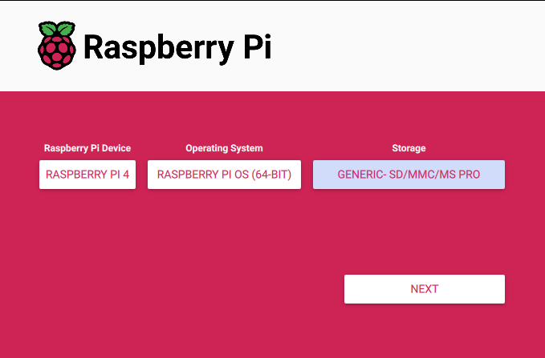
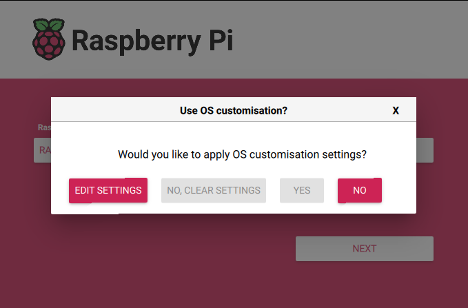
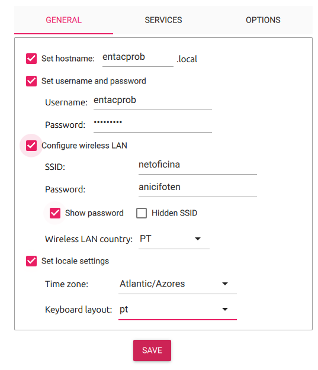
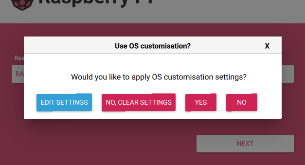
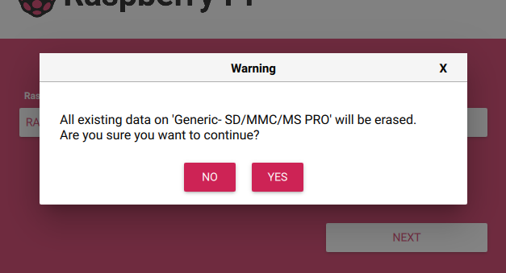
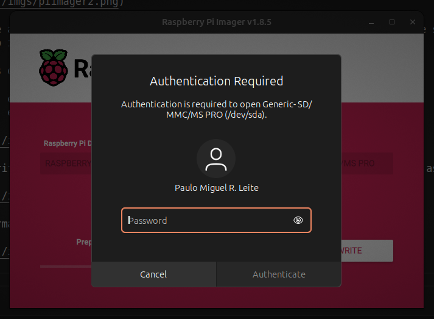
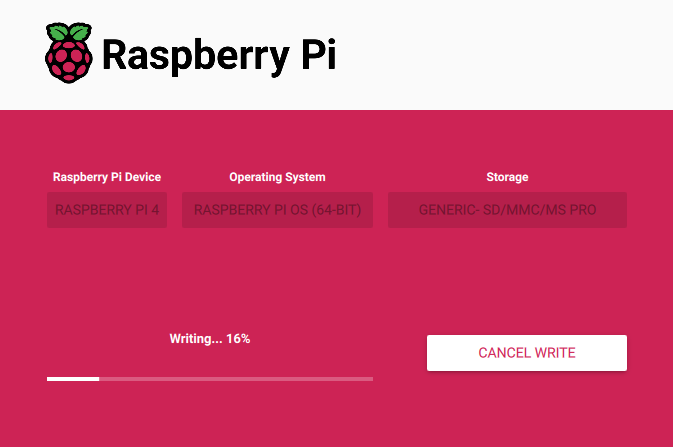
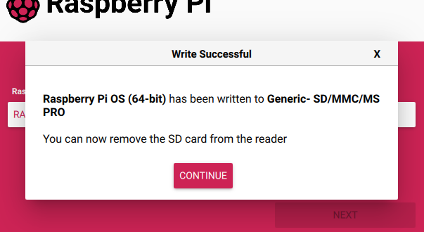

# enta-cpro-rov-os

Firmware do projeto ENTA-CPROB ROV

## Pré Requisitos

- Para a preparação do cartão com o PI OS.
    - Computador com acesso à internet e leitor de microSD
    - Cartão microSD com pelo menos 4GB

- Para a instalação do PI OS.
    - Raspbery PI 4
    - Monitor
    - Cabo miniHDMI -> HDMI
    - Teclado
    - Rato
    - Cartão préviamente preparado no passo anterior

## Preparação do cartão com o PI OS.

Fazer o download da aplicação PI-Imager em:
https://www.raspberrypi.com/software/

Instalar com o gestor de pacotes do debian:

```
sudo dpkm -i imager_1.8.5_amd64.deb
```

Abrir a aplicação imager e escolher o modelo do RaspberyPI, o sistema operativo e apontar para o cartão de memória que já deve estar inserido no leitor. Em seguida clicar no botão NEXT. 



No ecrão que irá surgir, clicar no botão EDIT SETTING



Configurar de acordo com a imagem seguinte, sendo que o hostname, user e pass pode ser uma qualquer. Não esquecer do user e pass, é muito importante!

As definições do WiFi vão depender do seu AP

user: entacprob
pass: entacprob



Depois de verificar que as configurações estão de acordo com o desejado, clicar no botão YES para as aceitar.



Surge uma janela a avisar que vai perder todos os dados que existem no cartão. 
Clique no botão YES para prosseguir.



O Ubuntu irá pedir credênciais de SUDO para avançar com o processo, Insira a sua password SUDO e aguarde até o processo de preparação do cartão terminar.





O imager irá posteriormente verificar a estrutura do cartão, apesar de ser facultativo e poder cancelar, aconselha-se que faça a verificação.


No final o imager informa que pode remover o cartão, para tal clique no botão CONTINUE, fecha a aplicação imager e remova o cartão do leitor.




## Instalação do PI OS

Ligue um teclado, rato e monitor ao RaspberyPI, insira o cartão preparado previamente, ligue o raspberyPI a uma fonte de energia de 5V 3A (Mínimo), pode ser pela porta USB-C ou diretamente pelos pinos de alimentação (caso da image)

Acompanhe as instruções no ecrã. A instalação demora alguns minutos e envolver alguns "restarts" do raspbery.

## Configuração do IP da placa Ethernet

Siga as instruções do PI OS para alteração do ip da placa ethernet do raspbery para o seguinte:

IP Address.....: 192.168.100.1
SubnetMask.....: 255.255.255.0  (/24)
Default Gateway: 192.168.100.1

### Ativar o serviço de VNC Server

(No RaspberyPI)
Abrir o aplicativo de configração do raspbery pi (no menu do sistema), ir à secção de interfaces e ativas o VNC

(No Linux)
Instalar o TigerVNC. Pode ser feito pelo gestor de aplicações do Ubuntu. 
Executar o TigerVNC inserir o IP configurado no passo anterior, confirmar que quer continuar quando for alertado para a falta de certificado, inserir as credênciais configuradas no primeiro passo.
Nesta altura já deve conseguir abrir remotamente o raspberyPI


### Ativar deteção de câmara

Editar o ficheiro de boot config.txt

```
sudo nano /boot/config.txt 
```

Verificar se as entradas das variaveis estão de acordo com o seguinte:

```bash
#start_x=1            #(Se existir, comentar)
camera_auto_detect=1  #(Se não existir, criar)

[all]
gpu_mem=256           #(Se não existir, criar)
dtoverlay=w1-gpio     #(Se não existir, criar)
enable_uart=1         #(Se não existir, criar)
```

### Arrancar com o rovOS

```bash
runrov
```


## Aceder ao stream de video

Para aceder ao stream de video deve utilizar o VLC, criar uma configuração de "Network Stream" com as seguintes propriedades.

```config
tcp/h264://<raspberyPi IP Addrress>:8888
```

Exemplo:

```config
tcp/h264://192.168.68.119:8888
```


O serviço de streaming é conseguido pelo aplicativo libcamera-vid, para mais informações consultar a literatura do produto em:

<https://www.raspberrypi.com/documentation/computers/camera_software.html#libcamera-vid>

O comando é lançado no rovOS.py com recurso à biblioteca subprocess e à classe Popen: 

```python
import subprocess

.
.
.

subprocess.Popen(["libcamera-vid", "-n", "-t",  "0", "--inline", "--listen",  "-o", "tcp://0.0.0.0:8888"])
```

Mais informação em:
<https://docs.python.org/3/library/subprocess.html>

## Multi-Tarefa em Python

A aplicação rovOS recorre à multitarefa asyncrona para rodar alguns processos


Em python é conseguido com recurso às seguintes bibliotecas:

- <https://docs.python.org/3/library/time.html> (redução de carga do processador)
- <https://docs.python.org/3/library/threading.html>  (Multitask)
- <https://docs.python.org/3/library/subprocess.html> (Multitask)

Mais informação em:

- <https://forums.raspberrypi.com/viewtopic.php?t=257859>
- <https://www.scaler.com/topics/multithreading-in-python/>
- <https://docs.python.org/3/library/asyncio-dev.html>

## Sensores

Sensores instalados

### ECSensor (Sensor de Condutividade da Água) - PINO A1

<https://wiki.dfrobot.com/Gravity__Analog_Electrical_Conductivity_Sensor___Meter_V2__K=1__SKU_DFR0300>
<https://github.com/DFRobot/DFRobot_EC10>

Para calibrar o sensor digite no terminal um dos seguintes comandos:

- enterec\nenterec -> enter the calibration mode
- calec\ncalec     -> calibrate with the standard buffer solution, one buffer solutions(12.88ms/cm) will be automaticlly recognized
- exitec\nexiet -> save the calibrated parameters and exit from calibration mode

Se por algum motivo não entrar no modo de calibração acrescente mais um \n{comando}, exemplo:

```Serial
enterec\nenterec\nenterec
```

### PHSensor (Sensor de PH da Água) - PINO A2

<https://github.com/DFRobot/DFRobot_PH/tree/master>
<https://github.com/DFRobot/DFRobot_PH/blob/master/example/DFRobot_PH_EC/DFRobot_PH_EC.ino>

Para calibrar o sensor digite no terminal um dos seguintes comandos:

- enterph\nenterph -> enter the calibration mode
- calph\ncalph  -> calibrate with the standard buffer solution, two buffer solutions(4.0 and 7.0) will be automaticlly recognized
- exitph\nexitph  -> save the calibrated parameters and exit from calibration mode