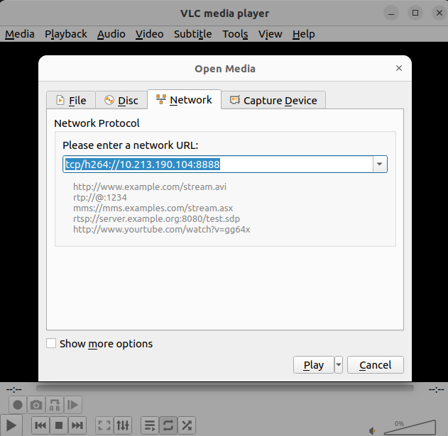
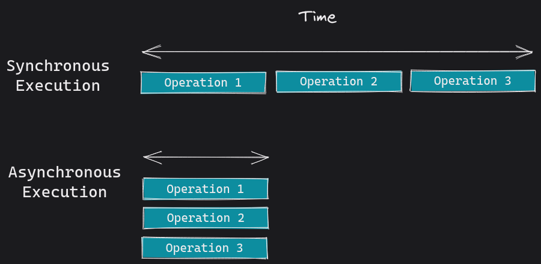

# enta-cpro-rov-os

Firmware do ROV

RaspberyPi Version:
Linux raspberrypi 6.1.61-v8+ #1696 SMP PREEMPT Thu Nov  2 16:44:46 GMT 2023 aarch64 GNU/Linux

## Prerequisitos

Algumas operações devem ser executadas no RaspberyPI antes de arrancar com os componentes de software.

### Ativar deteção de câmara

Editar o ficheiro de boot config.txt

```bash
sudo nano /boot/config.txt 
```

Verificar se as entradas das variaveis estão de acordo com o seguinte:

```bash
#start_x=1            #(Se existir, comentar)
camera_auto_detect=1  #(Se não existir, criar)

[all]
gpu_mem=256           #(Se não existir, criar)
dtoverlay=w1-gpio     #(Se não existir, criar)
enable_uart=1         #(Se não existir, criar)
```

### Ativar o serviço de VNC Server

```bash
sudo /etc/vnc/vncservice start vncserver-x11-serviced
```

### Arrancar com o rovOS

```bash
runrov
```

## Aceder ao stream de video

Para aceder ao stream de video deve utilizar o VLC, criar uma configuração de "Network Stream" com as seguintes propriedades.

```config
tcp/h264://<raspberyPi IP Addrress>:8888
```

Exemplo:

```config
tcp/h264://192.168.68.119:8888
```



O serviço de streaming é conseguido pelo aplicativo libcamera-vid, para mais informações consultar a literatura do produto em:

<https://www.raspberrypi.com/documentation/computers/camera_software.html#libcamera-vid>

O comando é lançado no rovOS.py com recurso à biblioteca subprocess e à classe Popen: 

```python
import subprocess

.
.
.

subprocess.Popen(["libcamera-vid", "-n", "-t",  "0", "--inline", "--listen",  "-o", "tcp://0.0.0.0:8888"])
```

Mais informação em:
<https://docs.python.org/3/library/subprocess.html>

## Multi-Tarefa em Python

A aplicação rovOS recorre à multitarefa asyncrona para rodar alguns processos



Em python é conseguido com recurso às seguintes bibliotecas:

- <https://docs.python.org/3/library/time.html> (redução de carga do processador)
- <https://docs.python.org/3/library/threading.html>  (Multitask)
- <https://docs.python.org/3/library/subprocess.html> (Multitask)

Mais informação em:

- <https://forums.raspberrypi.com/viewtopic.php?t=257859>
- <https://www.scaler.com/topics/multithreading-in-python/>
- <https://docs.python.org/3/library/asyncio-dev.html>

## Sensores

Sensores instalados

### ECSensor (Sensor de Condutividade da Água) - PINO A1

<https://wiki.dfrobot.com/Gravity__Analog_Electrical_Conductivity_Sensor___Meter_V2__K=1__SKU_DFR0300>
<https://github.com/DFRobot/DFRobot_EC10>

Para calibrar o sensor digite no terminal um dos seguintes comandos:

- enterec\nenterec -> enter the calibration mode
- calec\ncalec     -> calibrate with the standard buffer solution, one buffer solutions(12.88ms/cm) will be automaticlly recognized
- exitec\nexiet -> save the calibrated parameters and exit from calibration mode

Se por algum motivo não entrar no modo de calibração acrescente mais um \n{comando}, exemplo:

```Serial
enterec\nenterec\nenterec
```

### PHSensor (Sensor de PH da Água) - PINO A2

<https://github.com/DFRobot/DFRobot_PH/tree/master>
<https://github.com/DFRobot/DFRobot_PH/blob/master/example/DFRobot_PH_EC/DFRobot_PH_EC.ino>

Para calibrar o sensor digite no terminal um dos seguintes comandos:

- enterph\nenterph -> enter the calibration mode
- calph\ncalph  -> calibrate with the standard buffer solution, two buffer solutions(4.0 and 7.0) will be automaticlly recognized
- exitph\nexitph  -> save the calibrated parameters and exit from calibration mode